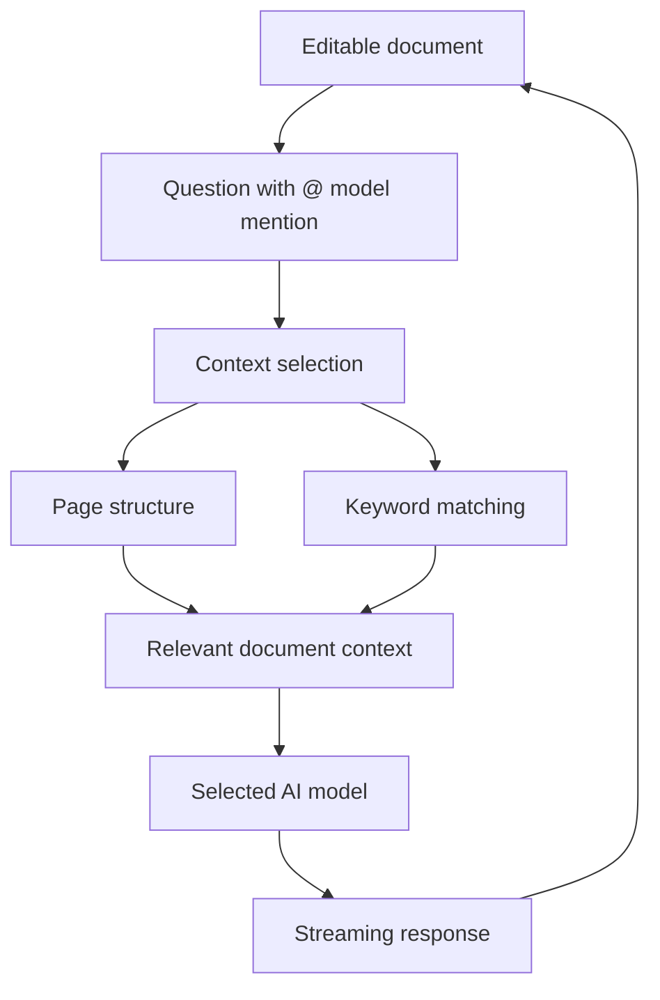

# Locus

Locus is an experimental AI-assisted writing workspace where notes and AI answers live on the same editable page.

Instead of putting AI in a separate chat window, Locus uses the structure of the document to decide what context is relevant to each question. This helps different topics stay isolated while keeping AI output directly editable alongside the user's notes.

**Live demo:** https://uselocus.dev/

> Locus is an early prototype and is not product-grade yet.

## Why Locus

Most AI writing tools separate the conversation from the document being edited. Locus explores a different interaction model:

- **Notes and AI answers share one page** — AI output can be rewritten, trimmed, moved, or restructured like normal content.
- **Context follows document structure** — nearby blocks and parent sections help determine what the AI should see.
- **Keyword-based retrieval adds relevant context** — terms from the question are used to find related notes higher in the page.
- **Multiple model providers** — OpenAI, Anthropic, Gemini, and Groq can be selected from the editor.
- **Streaming responses** — answers appear directly inside the editing experience instead of in a separate chat panel.

## How it works

A question is written directly in the document using an `@` model mention.

Before generating an answer, Locus gathers context from two sources:

1. **Page structure** — notes above the question at the same level, together with relevant parent blocks.
2. **Keyword matching** — terms derived from the question are searched upward through the page.

The selected context is then sent to the chosen model and the response is streamed back into the editor.



## Architecture

Locus is built as a Next.js application with the editor and most interaction logic running in the browser.

```text
Browser
├── Plate rich-text editor
├── Context-aware AI interaction
├── Model / API-key settings
└── Streaming response handling
        │
        ├── POST /api/ai/select-context
        │     └── Selects context strategy / keywords
        │
        └── POST /api/ai/command
              └── Streams the generated answer back to the editor
```

The AI routes resolve the selected provider and model on the server, while the editor owns the document state and applies streamed results back into the page.

## Technical highlights

### Structure-aware context selection

The main experiment in Locus is not simply connecting an editor to an LLM. The harder problem is deciding how much of a mixed-topic document should be sent with each question.

Locus uses the document hierarchy as a first signal and keyword matching as a second signal. The goal is to keep the context small and understandable instead of sending the entire page for every request.

### Rich-text editor integration

AI responses are part of the same document model as normal notes. This means generation has to work with editor selections, block structure, streamed updates, formatting, and user edits without turning the AI interaction into a separate application state.

### Multi-provider model support

The editor supports model selection across:

- OpenAI
- Anthropic
- Google Gemini
- Groq

Provider and model selection are resolved through a common application flow so the editing experience does not depend on a single model vendor.

### Streaming and failure handling

Generated text is streamed into the editor. The client also handles failed AI requests and rolls back incomplete insert operations when necessary so a failed request does not leave the editor in an inconsistent intermediate state.

## Tech stack

- **Framework:** Next.js 16, React 19, TypeScript
- **Editor:** Plate
- **AI:** Vercel AI SDK
- **Models:** OpenAI, Anthropic, Gemini, Groq
- **State:** Zustand
- **UI:** Tailwind CSS, Radix UI / shadcn-style components
- **Observability:** Vercel Analytics, Vercel Speed Insights

## Getting started

### 1. Install dependencies

```bash
npm install
```

### 2. Configure environment variables

Copy the example environment file:

```bash
cp .env.example .env.local
```

Available server-side variables:

```bash
# Default Gemini key used by the shared trial model
GOOGLE_GEMINI_KEY=""

# Optional for the copilot route
AI_GATEWAY_API_KEY=""
```

You can also add your own OpenAI, Anthropic, Gemini, or Groq API key from the application settings.

### 3. Start the development server

```bash
npm run dev
```

Open http://localhost:3000.

## Useful commands

```bash
npm run dev        # Start the development server
npm run build      # Create a production build
npm run lint       # Run ESLint
npm run typecheck  # Run TypeScript type checking
npm run format     # Format TypeScript / TSX files
```

## Project status

Locus is currently an early prototype used to explore document-native AI interaction and context selection. The current focus is on validating the interaction model and simplifying the technical design rather than treating it as a finished production product.
